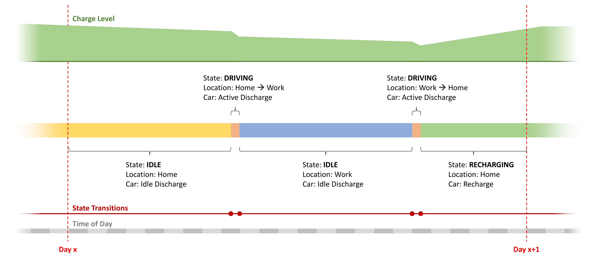

# EVDemand
*EVDemand* is an agent-based modelling framework to estimate electric vehicle (EV) charging demand.

Future transportation and a system-wide adoption of electric mobility highly depend on the capacity and ubiquity of the charging infrastructure.
To assure a level of electricity supply that is sufficient to meet the recharge demand, we  need realistic demand estimates taking socio-economic conditions into account.

To address this need, we developed an agent-based modelling framework that determines the spatiotemporal distribution of electric vehicle charging demand  considering commuting behaviour and accompanying charging needs of individuals, and reports the results in a detailed as well as aggregated manner.
The framework is implemented as open-source software that can be used to simulate various scenarios in a scalable manner starting from the city level up to the country level.

# EV Demand Analysis Framework

The framework, which is designed to allow a detailed analysis even with limited data, is based on agents mimicking the behaviour of individuals commuting  between home and work daily.
Each agent has a home location, a workplace location, a commuting behaviour (i.e., time to work and time to home), an EV with certain characteristics (e.g., charge capacity, maximum range, etc.), a location indicating its current spatial position and a state that is dynamically updated during an analysis based on various state transition rules.

There are three states defined by the framework that roughly correspond to different states of an EV:

-	*Idle state* indicates that the agent is located at a specific location (e.g., home, workplace) and the car is parked and not recharging; hence, subject to idle discharge.
-	*Driving state* indicates that the agent is travelling between two specific locations (e.g., from home to work) and the car is consuming the charge of its battery in driving mode.
-	*Recharging state* indicates that the agent is located at a specific location and the car is parked similar to the idle state, but it is connected to a charging station; hence, its battery is recharged.

The framework follows the state transition mechanism illustrated in the figure below to model the actions of an agent.
From midnight to the time to leave home for work (i.e., time to work), an agent can be either in idle or in recharge state at home.
This state is either assigned as the initial state at the beginning of the analysis if the analysis start time is within this period, or otherwise relayed from the previous day.
Then, a state transition occurs to a driving state from home to work for a duration that corresponds to the required travel time.
Once the agent arrives at work, it enters either an idle or a recharge state and stays in this state until the time to leave work for home (i.e., time to home).
To decide which state to select, the framework first checks if the agent can recharge, i.e., if there is a recharge station available to use.
If it is possible to recharge, then the framework checks if the agent wants to recharge.
If the outcome is positive, then a recharge state is started.
Otherwise, the state is set as idle.
The selected state changes into a driving state when the analysis time reaches the time to home, and the agent travels back to home, where it can enter again either an idle or a recharge state following the same probabilistic logic that is applied when it arrived at work.
This state continues until the time to work the next day, which completes a full transition cycle. 

